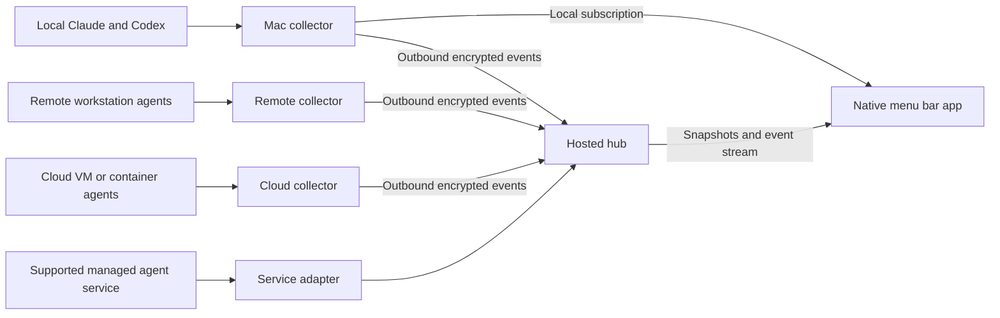

# Agents: macOS menu bar design

Status: canonical design proposal · September 10, 2026 · incorporates the Agent Tower review

Product name: **Agents**. “Orbit” and “Agent Tower” were exploration names and survive only in the file names and history of those explorations.

## 1. Product intent

A native Mac menu bar app that tells Darrin which Claude Code and Codex sessions need attention, what the others are doing, and where to return to the work. Sessions can run on this Mac, another workstation, a cloud VM, or a supported provider-managed environment.

The central interaction is: glance at the menu bar, open the panel, understand the next decision, jump to the right session. The app should feel like a small, precise instrument that is pleasant to keep running all day.

### Established requirements

- Combine Claude Code and Codex sessions in one view.
- Include sessions on other machines and in the cloud.
- Make the Mac menu bar the primary home.
- Give the product a distinctive, polished visual identity.

Everything below is a proposed implementation or product decision unless explicitly described as an existing capability. The HTML concepts demonstrate appearance and interaction; they are not a working monitoring system.

This is the canonical specification. The [Agent Tower design](docs/agent-tower-design.html) is the source for the local inventory and initial implementation exploration; decisions consolidated here supersede conflicting proposals there. Local observations below were verified by that reviewer on September 10, 2026, and supplied in the review. They are accepted as the initial compatibility inventory, not claimed as independently reproduced during this document merge. Phase 0 turns them into reproducible fixtures and validates the remaining gaps.

### Success criteria

Within a few seconds of opening the panel, the user can identify what needs them, read the reason, and locate the source session. An agent that has finished a turn, a machine that has disconnected, and an agent waiting for permission are visibly different states.

The first useful release must observe sessions started through the user's normal workflow. Requiring every session to be launched through this app would miss the main use case. Richer control can be added for integrations that support it.

The reported baseline is six Claude sessions blocked for 13–27 days. The outcome to measure is zero requests older than 24 hours that the user has not seen, alongside a decreasing backlog of unresolved requests. Deliberately deferred work remains unresolved but acknowledged; hiding, stopping, or misclassifying sessions must not improve the metric artificially. Record false positives and missed requests separately.

## 2. Scope

The initial product is for one person using multiple machines. It includes session discovery, status, an attention inbox, recent activity, source navigation where available, notifications, and machine connection health.

The first release does not include a replacement chat client, automatic approvals, autonomous task assignment, team administration, or a full transcript and diff editor. Usage analytics and file-overlap detection are later features. A completed turn is not proof that a task succeeded, and no percentage-complete indicator will be invented from elapsed time or token usage.

## 3. Menu bar experience

### Status item

Use the dot-grid glyph from the Agent Tower exploration, which Darrin prefers: the attention count beside a 3×3 grid of dots, one dot per active session, colored by state. Color and motion were tested on this Mac's menu bar; the limits below come from those measurements.

| Dot | Meaning |
| --- | --- |
| Red | A failure that needs intervention |
| Amber | A question or permission request |
| Cyan | Working |
| Last known color, dimmed | The session's source or machine is stale or offline |
| Dim neutral | Empty slot |

- **Count.** Sessions with an open question, permission, or failure episode, including older requests; not individual questions, so one session with three questions contributes one. Hidden at zero. Amber, or red while any failure episode is unseen. Reserve two-digit width so the item doesn't shift, and show `99+` above that. If every counted episode comes from a stale source, the count dims.
- **Order.** Failures, then questions and permissions, then working sessions; newest episode first within each, matching the panel. Dots keep their positions until the set of active sessions changes.
- **Overflow and coverage.** With more than nine active sessions, the last slot shows a small plus and the panel carries the full list. When any source stops reporting, the last slot shows a short dash instead, and the panel header names the source. The count is exact; the grid is a glance signal.
- **Inactive sessions.** Idle, ended, and ready-to-review sessions don't take slots. With nothing active, the grid shows nine dim dots so the item keeps its shape.
- **Without color.** The count alone answers whether anything needs you. With Differentiate Without Color on, failures draw as squares, requests as filled circles, and working sessions as rings. The accessible label states every part, for example “6 sessions need you, 1 failed, 3 working, remote collector not reporting.” A source that was never supported, such as account-wide Claude discovery today, is described in the panel rather than marked with the coverage dash.

**Motion.** A dot blinks only while its attention episode is unseen, meaning the panel hasn't shown it and its notification hasn't been opened. The blink is a two-state change about every 1.3 seconds, roughly 0.4% CPU. Seeing an episode stops the blink without resolving it. Working dots never animate, and requests imported at startup as older requests don't blink. Reduce Motion or a setting turns blinking off; it also pauses while the screen is locked or the displays sleep.

#### Menu bar spike results

Tested September 10, 2026 on macOS 26.6.2 with a Studio Display (main) and an LG UltraFine, using the command-line spikes and captures in `spikes/color-status-item/`:

- A non-template image keeps red, amber, and cyan distinct, both as an `NSStatusItem` button image and as a SwiftUI `MenuBarExtra` label. On the main display macOS mutes the colors (amber reads tan); the second display shows them at full strength. Color therefore doesn't decide between `MenuBarExtra` and AppKit.
- View and layer content rendered nearly white on the main display in every variant: Core Animation layers, an image view, and a custom `draw(_:)` view, with or without `allowsVibrancy` returning false. Draw the glyph as an image and animate by changing the image, not with Core Animation.
- The status button reported `VibrantLight` while the system was in Dark Mode. Choose glyph colors from the button's effective appearance, and tune them on light and dark wallpapers.
- Each menu bar update costs about 0.5% CPU per update per second, whatever the drawing method: 8 updates per second measured 4.2% with pre-rasterized bitmaps and 3.7% with a custom view; 1 per second measured 0.5–0.6%. A profile puts the time in AppKit layout, Core Animation commits, and messages to the menu bar host rather than in drawing. For comparison, iStat Menus Status used 1.3% for all of its items. Slow discrete blinks fit the CPU budget; continuous smooth animation doesn't. The spikes were unbundled binaries, so recheck in the real app bundle.

### Panel

Start around 412 points wide, anchored to the menu bar item. Height grows to a screen-aware cap; longer lists scroll inside the panel. Keep essential navigation visible. The default ordering is:

1. **Needs you:** questions, permission requests, and actionable terminal failures, newest attention episode first. Requests older than seven days appear in a collapsed **Older requests** group within this section, ordered newest first. Keep its unresolved count visible and included in the menu bar count; search includes it. Opening it reviews the requests rather than stopping their sessions.
2. **Working:** sessions with observed active turns, with stable ordering while the user interacts.
3. **Ready to review:** completed turns with output the user has not acknowledged.
4. **Idle and disconnected:** collapsed when there are many, with a visible count and last-contact information.

Show task title first. Below it, show provider, project, and machine. The next line answers why the row is here: an actual question excerpt, permission reason, latest activity, or completion summary. Display waiting duration for attention rows and last-activity age for working rows; label the distinction.

Allow a session to retain an unresolved question while disconnected, but mark it stale and disable remote responses. Its last observed state remains visible. A transient tool failure that the agent recovers from should stay in activity history rather than repeatedly becoming an inbox item.

### Activity lines

Each Working row shows a small line of what the agent has produced recently, so a busy session and a stalled one look different at a glance. The detail view shows the same line larger with its peak value.

- **Measure.** Output tokens per minute over the last 15 minutes, in 30-second buckets. Each model response's tokens count in the bucket where the response completed, so the line is bursty by nature; it shows rhythm, not throughput precision.
- **Claude Code source.** Assistant transcript entries: timestamp plus `message.usage.output_tokens`. Transcripts repeat an entry per content block, so deduplicate by `message.id` and keep the largest count.
- **Codex source.** Rollout `token_count` events: the increase in `total_token_usage.output_tokens` between consecutive events, at the event's timestamp. Phase 0 confirms whether `output_tokens` already includes `reasoning_output_tokens`, and does the same for Claude thinking tokens, so both providers count the same thing.
- **Tool time.** A tool call runs from the call (Claude `tool_use`; Codex `function_call` or `custom_tool_call`) to its result. Draw those spans as a dotted neutral baseline so a long test run reads as working, not as a stall.
- **Quiet.** When a working session has had no response and no open tool call for 10 minutes, the row adds a factual tag such as “quiet 26m”. It never claims the session is stuck.
- **Scale.** Each row scales to its own 15-minute peak with a floor of 1,000 tokens per minute, so a trickle doesn't look like a burst. Lines are not comparable across rows; the detail view labels the peak.
- **No data.** If a source provides no token events, show no line and the label “no activity data”. A flat line always means observed silence.
- **Where.** Working rows and the detail view only. Needs-you rows show waiting time instead.
- **Cost.** Render in the panel, never the menu bar. Recompute from stored events at most once per second while the panel is open; do nothing while it's closed.
- **Accessibility.** The line's accessible value summarizes it, for example “1,444 output tokens in the last 15 minutes; quiet for 1 minute.”

On this Mac between 2:47 and 3:02 PM on September 10, one Claude session was reported working but had produced nothing since 2:35 PM, a flat line with “quiet 26m”; this session produced 11,787 output tokens in three bursts, with tools running in six of the 30 buckets; and the Codex thread “Design an agent dashboard” started at 2:59 PM with 1,444 tokens. The mockup draws these measured values with sample session names and messages.

“Older requests” describes age; “connection stale” describes missing updates. These are independent. New events must not move the selected row while the user reads or acts on it.

Search appears as “Jump to session” and matches title, project, machine, and provider. Project and machine filtering belong in the expanded session view if the compact panel becomes crowded. Subagents nest under their parent by default; a child requiring attention can appear in the inbox with the parent path visible, without counting the same request twice.

### Session detail and navigation

Selecting a row expands its details in place: the current question or status, recent timestamped events, project/branch/worktree when available, and the source connection's freshness. Selecting it again collapses it. Several sessions can remain expanded, and expansion preserves the list's scroll position. Group headers, including Older requests, toggle across their entire row rather than only on the caret.

The primary action is **Open session** only when the integration has a verified destination. Otherwise, offer the concrete fallback: open the project, copy the session ID, or show a supported resume command. Opening an existing session and resuming one are different actions and must be labeled separately. Do not silently start a second process to imitate focusing an existing one.

A local terminal, IDE, desktop app, remote terminal, and hosted session page need different navigation adapters. Arbitrary terminal-tab focusing is an integration spike, not a launch promise. Remote paths are interpreted on the originating machine, never as local Mac paths.

Ship verified source navigation in v1. For supported local Claude background sessions, use the reported `claude attach <id>` path once the terminal invocation is tested. For a live Codex Desktop or IDE thread, focus its existing source through a verified adapter; otherwise show the concrete project or ID fallback. `codex resume <id>` is an explicitly labeled later resume action for an inactive thread, never an “Open” shortcut for a live thread. Stop, restart, and reply are control actions deferred to Phase 3, even where commands already exist.

A configurable shortcut opens the panel. Arrow keys navigate, Return toggles expansion of the selection, and Escape collapses expanded sessions or closes the panel. The exact global shortcut is configurable to avoid collisions; the mockup's Option-Space is a candidate. Settings and an optional larger history window remain conventional Mac windows. Bundle an offline Setup & Help window with the app, reachable from the panel and Settings, so distributed copies do not depend on the source repository for setup instructions.

### Notifications

Notify on a newly actionable question, permission request, or terminal failure. Completion notifications are opt-in, with optional subtle sounds. Clicking a notification opens the matching session detail.

Show confirmed waiting states in the panel and icon promptly. Debounce notification banners for a proposed 20 seconds so an auto-resolved request does not interrupt the user; recheck the attention episode before delivery. Do not apply that delay to established older requests imported at startup. Coalesce bursts of more than three newly actionable sessions in a minute into a summary.

Deduplicate by session and attention episode. Clear the episode only on evidence of resolution; merely opening the panel does not resolve it. Viewing a finished result can mark it reviewed. Support snoozing without changing the underlying session state. Coalesce bursts, respect system notification preferences, and summarize events missed during sleep instead of replaying every banner.

### Empty and degraded states

- No connected sources: show setup for this Mac and another machine.
- Sources connected but no sessions: “No active sessions,” with access to history.
- Source lacks live status: “History available · live status unavailable.”
- Hub unreachable: preserve cached remote sessions and continue observing local sessions.
- Machine unreachable: show last contact; do not label its sessions finished or failed.
- Local collector not running: show cached sessions marked stale, the coverage dash in the menu bar, and a Restart collector action.

## 4. Visual direction

Two explorations inform the design:

- [Orbit exploration](design/orbit-menubar.html): a compact, restrained panel with clear grouping and inline session detail.
- [Agents mockup](mockups/agent-tower.html), from the Agent Tower exploration: a more expressive instrument aesthetic with glass, an attention readout, cyan activity, and amber decisions. It now follows this document's sections and shows both appearances.

Proposed synthesis: retain Orbit's information hierarchy and adopt the Agent Tower exploration's stronger identity. The app follows the system appearance by default, with the dark instrument appearance as an option. Use native materials where they preserve legibility, opaque surfaces when Reduce Transparency is enabled, and restrained edge highlights. Orbit uses illustrative sessions; the Agents mockup draws on dated local observations. Neither mockup is live telemetry, and any illustrative ages must be labeled rather than substituted for measured state-transition times.

Use system typography for readable titles and messages. Reserve a distinctive numeric treatment for the attention count and small monospaced metadata. Bundle any approved custom fonts with their licenses; the native app should not depend on web font delivery.

Color roles are stable: amber for a decision, cyan for activity, red for an actionable failure, and neutral gray for idle or stale information. Pair every color with a label or shape. Waveforms and sparklines must derive from observed events and say what they measure; the activity lines in §3 are the only ones planned.

### Palette

Starting values from the mockup, to be tuned at native scale. Text colors meet 4.5:1 against the opaque surface; dot and line colors meet 3:1. On the translucent panel, check contrast against the busiest wallpaper in use.

| Role | Light (default) | Dark instrument |
| --- | --- | --- |
| Opaque surface (Reduce Transparency) | `#F4F7F6` | `#12181A` |
| Glass tint over the wallpaper | `rgba(248,250,249,0.74)` | `rgba(18,24,26,0.62)` |
| Primary text | `#142022` | `#E7ECE9` |
| Secondary text | `#4A5956` | `#9AA7A3` |
| Tertiary text and metadata | `#647370` | `#7C8A86` |
| Hairline | `rgba(20,32,34,0.10)` | `rgba(214,236,229,0.09)` |
| Decision: count and text | `#A35F00` | `#FFB547` |
| Decision: dot | `#C97700` | `#FFB547` |
| Activity: text | `#0E7F71` | `#62E3CF` |
| Activity: dot and line | `#0F9A89` | `#62E3CF` |
| Failure: text | `#C2392A` | `#FF6A5C` |
| Failure: dot | `#E0483A` | `#FF6A5C` |
| Idle, stale, and tool-running segments | `#8A9794` | `#7E8C88` |
| Claude label | `#9A5530` | `#E9B394` |
| Codex label | `#4257B2` | `#B7C4F5` |

The menu bar glyph picks the light or dark set from its status button's effective appearance, not the panel's, because the menu bar can be light while the system is dark (§3 spike).

The polish comes from smooth detail transitions, stable list positions, crisp small-scale glyphs, accurate labels, fast opening, and excellent keyboard behavior. “Cool” must survive a quiet fleet and a crowded fleet equally well.

## 5. Architecture

### Native app

Use SwiftUI for views and native Mac integration. Prototype `MenuBarExtra` with the window style, which Apple defines as a popover-like window. Use AppKit integration where required for positioning, focus, or shortcut behavior; validate those interactions before committing to a custom panel implementation. [Apple documentation](https://developer.apple.com/documentation/swiftui/menubarextrastyle/window).

The colored glyph doesn't constrain this choice: the menu bar spike (§3) showed a colored image label surviving in both `MenuBarExtra` and `NSStatusItem`. Opening the panel from the global shortcut and keyboard focus remain the deciding tests.

The app renders cached state immediately, then subscribes to updates. Its local cache keeps recent sessions available when the hub is down. Closing the panel does not stop collection. Launch at login is an explicit setting; deployment and signing details are decided during the native prototype.

### Collector

A small background process runs next to the sessions on each supported machine. It discovers sources, adapts provider events to a common schema, stores a bounded local outbox, reports health, and forwards events to the hub. Provider parsing lives here, outside the UI.

Proposed collector implementation: Go, producing standalone macOS and Linux binaries with SQLite for durable state. Confirm needed platform support in the integration spike; Windows is deferred initially. The Mac app communicates through a user-restricted local socket. Where hooks require HTTP, expose only an authenticated loopback endpoint.

Observation hooks enqueue locally and return promptly. They must not wait for cloud connectivity, change approval policy, block an agent's work, or turn an observability outage into a failed agent operation. Unsupported versions are reported explicitly.

### Hub

The hub authenticates devices, ingests events, maintains current session projections and history, and serves snapshots plus resumable updates. It remains available while the Mac sleeps. Start with one deployable service and a durable database; choose the hosting provider after validating the event contract. A single-instance implementation can use SQLite on persistent storage, with backups. Do not put durable state on an ephemeral container filesystem.

Collectors initiate all connections; remote machines need no publicly exposed listener. Start with outbound HTTPS event batches and an app subscription over a resumable stream. A return channel for commands is a separate, later capability.

Local use works without a hub account. Remote monitoring requires an enrolled collector or a supported service adapter. Direct local events and hub echoes share identity so the Mac does not display duplicates. A degraded hub connection does not override fresher local evidence.

## 6. Provider integration and coverage

Coverage has two independent dimensions: what the adapter can observe and what it can control. Each session advertises capabilities such as `read_history`, `observe_live`, `open_source`, `send_message`, `interrupt`, and `respond_to_request`. The UI exposes only the actions currently supported and authorized.

| Session source | Observation plan | Control expectation |
| --- | --- | --- |
| Claude Code on a machine we manage | `claude agents --json` inventory and reconciliation, transcript enrichment, and hooks for prompt updates | Verified attach/open in v1; control later |
| Codex already running in an app or terminal | Test the existing shared App Server first; read-only database and rollout fallback | Verify scope before advertising live observation or control |
| Codex connected through an Agents-managed App Server | Thread/item events and state through that server | Offer verified per-session actions in a later phase |
| Agents on our cloud VMs or containers | Same collector, injected into the machine or workload | Depends on the provider integration and process ownership |
| OpenAI Agents API sessions | Session event stream or webhooks (see below) | Steering exists in the API; offer nothing until verified |
| Other provider-managed cloud service | Supported authenticated API, hooks, or webhooks, where available | Service-specific; unavailable until verified |

### Claude Code

Use `claude agents --json` as the initial inventory and reconciliation input. The reviewer confirmed that it reports `blocked`, `working`, and `done` for background sessions already running on this Mac. Enrich with session files and incrementally read transcripts. Hooks improve event timing for sessions that have loaded them; they are not a prerequisite for adopting weeks-old sessions.

The documented lifecycle includes session start/end, prompt submission, tool events, notifications, and turn-stop events. Hook context can identify the session. A `Stop` event means the assistant finished responding; it does not establish task success. An individual tool failure need not mean the turn failed. [Claude Code hook reference](https://code.claude.com/docs/en/hooks).

Reported transcript error signals include `isApiErrorMessage` and `model_refusal_no_fallback`. Treat them as evidence for the relevant turn, then check for subsequent recovery or activity before opening a failure episode. A transcript's last timestamp may be an informational system entry; it cannot establish when a request began. Preserve a directly observed transition time when available, otherwise record an inferred time and its evidence.

Notification hooks can indicate waiting for input or permission. Their timing and host behavior vary, so the adapter must identify the notification type and avoid treating every notification as a pending approval. [Claude Code hook guide](https://code.claude.com/docs/en/hooks-guide).

Optional OpenTelemetry integration can enrich usage and diagnostics. It is not a prerequisite for the attention inbox. Display measured tokens and reported cost separately from estimates or subscription billing. [Claude Code monitoring](https://code.claude.com/docs/en/monitoring-usage).

### Codex

The documented App Server includes thread listing and reading, thread-status notifications, turn and item events, and methods to start, steer, and interrupt turns. These establish an integration path for threads available through the connected server; they do not by themselves establish visibility into every independently running Codex process. [Codex App Server](https://developers.openai.com/codex/app-server).

The first spike must determine how the installed desktop app and CLI expose existing sessions. Read-only logs or databases may provide partial history if no supported live interface is available. Treat such formats as version-sensitive fallbacks: isolate them behind adapters, open read-only, tolerate concurrent writes, and report unknown status when evidence is insufficient. Do not hardcode a database filename from a mockup as the product contract. Never resume, archive, or mutate threads merely to discover them.

The reviewer reports that Codex Desktop runs `codex app-server --listen` and that `codex agents` describes a shared local App Server daemon. This is evidence to test the existing daemon first, not proof that a newly launched server can subscribe to every live thread. Compare discovery, history, live status, and event subscription separately for Desktop and CLI sessions.

### OpenAI Agents API

OpenAI published an Agents API that runs sessions on OpenAI's side using the Codex harness ([overview](https://developers.openai.com/api/docs/guides/agents-api/overview), [quickstart](https://developers.openai.com/api/docs/guides/agents-api/quickstart), read September 10, 2026). As documented there:

- It is a beta requiring the `OpenAI-Beta: agents=v1` header. `POST /v1/agents/sessions` creates a session, submits a task, and streams progress; sessions can be retrieved with their saved items and deleted.
- Clients follow progress by streaming or webhooks, including when the agent finishes or needs input, and can steer a running turn.
- Events include `agent.session.turn.completed`, `turn.failed`, `turn.cancelled`, `session.failed`, and `agent.session.idle`. The guide warns that a completed turn doesn't mean every tool succeeded and that idle alone doesn't mean success, which matches §7's separation of turn outcome from attention.

This is the first named candidate for a provider-managed connector. It covers only sessions created through the API under the connected organization or project, not Codex Desktop or CLI threads, so it adds coverage rather than replacing the local Codex adapters. Webhooks fit the always-on hub, but reading session items needs an API key; keep that key on an enrolled collector by default and treat storing a restricted key in the hub as an explicit opt-in. Not yet verified: a list-sessions endpoint for adopting existing sessions, the exact needs-input and approval event names, and webhook payload and signature format. Add the connector only if Darrin runs Agents API sessions.

### Initial compatibility inventory

Source: the Agent Tower review, reporting Claude Code 2.1.267 and Codex 0.153.4 on this Mac. Phase 0 captures command help, schemas, and sanitized representative events for each supported version. Availability of a command does not by itself prove that an action is appropriate for every session kind.

| Source or command | Reported local finding | Planned use and remaining validation |
| --- | --- | --- |
| `claude agents --json` | Existing local sessions and background `blocked`/`working`/`done` state; reported documented scripting flag. Interactive sessions were listed with no state. | Primary Claude inventory. Interactive waiting needs hook or transcript evidence. |
| `~/.claude/sessions/<pid>.json` | Process state, last update, `bridgeSessionId`, and socket metadata | Version-sensitive enrichment and identity aliases |
| Claude project JSONL transcripts | Messages, error markers, token usage, PR links, and worktree/file activity | Incremental enrichment; attribute fields and avoid bookkeeping timestamps |
| Claude lifecycle hooks | Timely events for sessions that loaded the configuration | Complement inventory; test live-session configuration adoption |
| Existing Codex App Server and `codex agents` | Desktop listener and a reported shared-daemon discovery path | First spike: verify access to existing Desktop and CLI threads without resuming them |
| `~/.codex/state_5.sqlite` and rollout JSONL | Thread metadata, parent links, and turn events | Read-only fallback; discover schema and validate versions rather than pinning this filename |
| Codex `notify` | Single command slot already occupied by Codex Computer Use | Preserve through a wrapper; reconcile missed completion events from other inputs |
| `bridgeSessionId` | Local Claude ID linked to Remote Control/cloud identity | Merge only on explicit provider identity, retaining source capabilities and freshness |
| `claude attach`, `stop`, `respawn`, `logs`; `codex queue` | Commands reported available | Attach/navigation in v1 after testing; mutation commands deferred |
| `codex cloud list --json` | Cloud-task discovery through the local Codex login | Validate schema, lifecycle coverage, and polling on an appropriate collector |
| Terminal | Ghostty is the only terminal installed | First navigation adapter for `claude attach`; test opening a new window that runs a command |
| Claude account-wide session discovery | Reviewer found no API or CLI path | Unresolved gap; validate provider hooks and access before promising cloud coverage |

### Efficient file ingestion

The reviewer measured a 55 MB transcript and roughly 3.6 GB across Claude and Codex session folders. Do not parse all history at startup. Watch relevant directories, keep byte offsets, and read a bounded tail on first contact, initially 512 KB. Preserve partial JSONL records across reads; detect replacement, truncation, and rotation. If a tail lacks the state-establishing event, consult the inventory or a bounded earlier read and retain unknown fields rather than guessing. Include old sessions that are still live even when their files have not changed recently. Treat file watches as hints and reconcile periodically, initially every 15 seconds.

### Hook and notification configuration

Install only owned configuration entries and preserve existing ones. Observation handlers enqueue to the local collector with a short bound and never wait for cloud delivery. An always-successful exit prevents a hook error from blocking the agent, but does not imply zero latency; measure enqueue overhead against the performance target.

For Codex, preserve the existing Computer Use `notify` command through a wrapper with exactly forwarded arguments and no shell-string reinterpretation. Invoke the existing handler once and enqueue its own event independently so a slow or failing branch does not suppress the other. Match the existing handler's required execution semantics and test failure, timeout, and exit behavior before installing the wrapper. Store the prior setting; on uninstall restore it only if the installed setting is still the Agents wrapper, preserving subsequent user edits. The inventory and event reconciliation remain authoritative if notification delivery is missed.

### Bootstrap and adoption

On first connection, take an inventory snapshot and start streaming without losing events between the two operations. Label imported history separately from newly observed activity. Existing sessions may need a supported hook reload or a restart before live coverage begins; detect and communicate this instead of assuming retroactive coverage.

Persist source cursors and reconcile after restart. Match multiple observations using provider-native IDs and source provenance; do not merge sessions solely because their project or title matches. Preserve parent/child relationships when actually supplied.

Use the reported `bridgeSessionId` as a concrete alias when local Claude and Remote Control observations explicitly identify the same provider session. One logical row can have several observations, with different freshness and capabilities; prefer a reachable verified local navigation target. Do not let a stale remote copy overwrite fresher local state. Reconcile Codex aliases across daemon and file adapters similarly, retaining source scope.

## 7. State and event model

Keep these dimensions separate:

| Dimension | Example values |
| --- | --- |
| Execution | unknown, idle, working, ended |
| Latest turn outcome | unknown, completed, failed, interrupted |
| Attention | none, question, permission, failure, review |
| Connectivity | online, stale, offline |
| Evidence | provider event, snapshot, inferred from history |

“Ready to review” is a product state based on an observed completed turn and an unreviewed result. It is not a claim of verified correctness. A session can be idle with a completed latest turn, or last known working while its machine is offline.

A higher-quality source does not outrank newer resolution evidence forever. Match hooks, snapshots, and transcript events to the relevant turn/request and reconcile their freshness. A past permission hook must not pin a session to waiting after observed continued work resolves that request. A repeated identical state can contain a new attention episode and legitimately notify again; opening or acknowledging an episode does not resolve it.

The panel and menu bar derive from these dimensions:

| Condition | Panel section | Menu bar |
| --- | --- | --- |
| Open question or permission episode | Needs you; Older requests after seven days | Amber dot; counted |
| Open failure episode | Needs you | Red dot; counted; count red while unseen |
| Working, no open episode | Working | Cyan dot |
| Completed turn not yet reviewed | Ready to review | No dot; not counted |
| Idle, ended, or unknown, no open episode | Idle and disconnected | No dot; never counted |
| Source stale or offline | Keeps its section, marked stale | Last known dot dimmed; last slot shows the coverage dash |

An episode is unseen until the panel has displayed it or its notification has been opened. Unseen changes emphasis only, meaning the blink and the red count. It never changes state, ordering, or whether the session is counted.

Core records:

- **Machine:** opaque enrollment ID, display name, platform, installation identity, collector version, heartbeat, and capabilities. Credentials never derive from the display name.
- **Session:** internal ID, machine/source scope, provider-native ID, optional parent, title, project ID, branch/worktree, state dimensions, last event, last activity, and navigation target.
- **Event:** schema version, event ID, session ID, source stream and generation, sequence number, occurrence time, receipt time, event type, evidence type, and a bounded payload.
- **Attention episode:** stable ID, session and optional turn/request ID, kind, opened time, resolution evidence, snooze state, and notification state.
- **Project:** user-facing identity with explicit aliases for repositories across machines. Normalize remotes without credentials; allow manual grouping where remotes differ.

A session key is scoped by enrollment, provider, and source namespace as well as native ID. Store migration aliases if a machine is deliberately re-enrolled. Repo identity is for grouping, never a substitute for session identity.

Project file changes need attribution. A Git working-tree diff shared by two agents is not proof that either agent made each change. Later overlap detection must distinguish observed agent edits from an unattributed repository snapshot.

## 8. Delivery and failure behavior

Use at-least-once event delivery. The collector assigns durable IDs and stores events before sending; the hub acknowledges only after durable ingestion. Duplicate delivery does not create duplicate history or notifications.

Order events within a source stream using its generation and sequence. Use timestamps for display, not as the sole ordering authority across machines with clock skew. A delayed old turn event must not regress a newer turn's state. Reconcile disagreements using provenance, source cursors, and turn identity; mark uncertainty rather than fabricate a total order between unrelated streams.

Proposed health defaults: heartbeat every 15 seconds while connected, stale after 45 seconds without contact, offline after two minutes. Tune after sleep/wake and network tests. Machine contact and session activity are separate measurements: a quiet model run can still be on a healthy machine.

Reconnect with exponential backoff and jitter. Resume from an acknowledged cursor or obtain a new snapshot if history has expired. Bound the outbox by bytes and age; preserve state transitions before verbose output, compact where possible, and emit a visible history-gap record if events must be dropped. Proposed starting limits are 100 MB or seven days, whichever is reached first.

Ephemeral workers stream promptly and attempt a bounded final flush. Abrupt termination can lose unsent data; heartbeat expiry records loss of contact, not successful completion. Reusing a container image must not reuse a device credential or installation identity.

## 9. Data boundaries and future control

Pair each machine using a short-lived, single-use enrollment token. Issue a device-specific credential scoped to its own event ingestion and rotate or revoke it independently. Authenticate the Mac client separately. Store Mac credentials in Keychain and remote credentials in protected machine storage. Use encrypted transport and enforce ownership at every session and event boundary.

By default, upload structured status, safe project aliases, machine labels, and event types. Full transcripts, prompts, tool arguments, output, and question excerpts can contain secrets or proprietary content. Make richer text sharing an explicit per-source setting, with payload limits and filtering applied before upload. When disabled, display a generic reason and offer source navigation. Notifications should support hiding message content.

Define a separate allowlisted upload schema; do not serialize the local session object and merely remove file paths. In particular, omit `ask`, `lastMessage`, free-form error details, raw commands, and navigation paths unless the corresponding sharing policy explicitly permits them. Activity buckets (token counts and tool-running spans, without tool names or arguments) are structured status and may be uploaded.

Proposed retention is seven days for detailed activity and 30 days for session summaries, configurable. Raw transcripts remain at the source unless explicitly enabled. Deletion must cover hub records and app caches; a replay barrier prevents an old collector outbox from resurrecting deliberately deleted history.

Remote control is not part of the initial release. When added, each command must carry the exact session, request/turn identity, a unique command ID, an expiry, and the expected state. The collector revalidates state and authority before acting. Never replay an expired approval after reconnecting. If execution occurred but acknowledgement was lost, reconcile the result instead of blindly retrying. Keep an audit trail of user intent and execution result. Do not implement control through arbitrary remote shell strings or synthetic typing into an unidentified terminal.

## 10. Performance and quality targets

These are acceptance targets, not measured results:

| Area | Initial target |
| --- | --- |
| Warm panel opening | Under 150 ms to cached content |
| Status propagation | Under 1 second locally; under 3 seconds remotely on a healthy connection |
| Steady idle CPU | Under 1% combined app and collector on the target Mac with no unseen episodes; blinking adds about 0.4% |
| Menu bar updates | At most about one per second outside a blink; measured at about 0.5% CPU per update per second |
| Activity lines | Redraw at most once per second while the panel is open; no work while it's closed |
| Typical memory | Under 150 MB combined for 50 active sessions |
| Fleet scale | Responsive with 100 active sessions across 10 machines |
| Observation hook overhead | Local enqueue under 50 ms at the 95th percentile |

Validate with measured event traffic and the actual deployment target. Coalesce presentation updates during bursts, avoid token-by-token redraws, and suspend decorative work when the panel is hidden. Provider events update the underlying state even when rendering is throttled.

Required verification focuses on behavior: duplicate and reordered events, stale questions resolving, simultaneous sources, collector crashes, hub outages, Mac sleep/wake, expired cursors, clock skew, and abrupt container termination. Include native checks for keyboard navigation, VoiceOver, Reduce Motion, Reduce Transparency, multiple displays, auto-hidden menu bars, long titles, empty states, and large fleets. Versioned provider fixtures should represent actual observed formats without personal transcript content.

## 11. Delivery plan

### Phase 0: prove coverage and native behavior

First, test the existing shared Codex App Server: identify its endpoint and supported connection/authentication mechanism, enumerate existing Desktop and CLI threads, read them without resuming, and verify that live events and pending approvals are visible for each source. Record discovery-only coverage separately from live subscriptions. Do not start a replacement daemon or mutate a thread to make the test pass. If that surface cannot supply the required data, use the recorded database and rollout fallback and expose its limits.

Next, reproduce the initial compatibility inventory above and observe an already-running Claude session through `claude agents --json`, including one created before hook installation. Exercise working, waiting, completed-turn, failure, and disconnected states. Establish which statuses are exact, inferred, or unavailable. Test Claude attach, Codex source navigation, and the preservation of the existing notify handler. Prototype `MenuBarExtra` positioning, global-shortcut opening, keyboard focus, and sleep/wake behavior; use AppKit if the prototype demonstrates a gap. Status item color and update cost are already measured (§3); what remains for the glyph is palette tuning on light and dark menu bars and a CPU check inside the real app bundle.

Deliver a compatibility matrix with provider versions, source surfaces, capability limits, and sanitized event fixtures. If an existing source cannot be monitored live, document the concrete limit and available fallback before promising comprehensive coverage.

### Phase 1: local daily-use app

Ship the native status item, local collector, attention inbox, detail view, cached history, source navigation, and deduplicated notifications. Support existing-session adoption to the extent proven in Phase 0. Include setup, diagnostics, and reversible hook installation that preserves existing configuration.

Exit criterion: use it for a full working day with both providers; every tested attention transition is represented correctly, collection survives restart, and missing coverage is visible.

Hooks, completion-handler preservation, and error/recovery classification belong in this phase rather than a later accuracy milestone. Evaluate the six reported old requests without requiring their sessions to restart. Verify that newer requests remain easy to find while old requests stay counted and reviewable.

### Phase 2: remote daily-use app

Add the durable hub, enrollment/revocation, macOS and Linux collectors, remote history, freshness states, and offline replay. Test one remote workstation and one cloud VM or container. Local monitoring continues through a hub outage; remote history continues accumulating while the Mac sleeps.

This is the first release that satisfies the complete local-and-cloud product scope. A provider-managed cloud connector is included only after its interface is verified; otherwise its absence is explicit.

For Codex Cloud, test the reported CLI polling path using the source machine's existing login; do not put OpenAI credentials in the hub. If polling runs only on the Mac, label cloud coverage unavailable while it sleeps. Continuous coverage requires a suitably authenticated always-on collector or verified service integration. The account-wide Claude discovery gap remains explicit until solved.

### Phase 3: selective control and deeper insight

Add supported response and interruption actions, managed launches where useful, and richer history or diff views. Introduce usage reporting and file-overlap warnings only with attributable data. Keep each connector's control permissions separate from monitoring access.

## 12. Open decisions

| Decision | Proposed direction | What resolves it |
| --- | --- | --- |
| Visual treatment | Native panel with the instrument aesthetic; colored per-session dot grid in the menu bar (decided) | Palette tuning at actual menu bar scale on both displays |
| Minimum macOS version | macOS 26; color and update cost measured on 26.6.2 only | Decide whether earlier releases are worth testing |
| Existing Codex session coverage | Best supported read-only interface first | Installed-version integration spike |
| Terminal and app navigation | Verified adapter per source | Test actual terminal, IDE, and desktop app workflow |
| Hub host | One small service with durable storage | Deployment preference after protocol validation |
| Managed cloud services | Add named services individually; the OpenAI Agents API is the first candidate | Whether Darrin runs Agents API sessions, and verification of its listing, needs-input, and webhook interfaces |
| Custom count typeface | Both mockups use Doto (SIL Open Font License) for the attention count | Legibility at menu bar size on both displays, then bundle it or use SF Mono |
| Remote text sharing | Structured status by default | User's per-source preference for question excerpts and summaries |

## 13. Implementation starting point

Begin with a vertical slice: one existing Claude session and one existing Codex session feeding the same local model, displayed in a native panel with accurate attention and freshness states. Preserve the collector/hub event boundary from day one, then add a remote collector without redesigning the UI. This tests the hardest assumption—reliable visibility into the sessions already running—before investing in broader control features.
